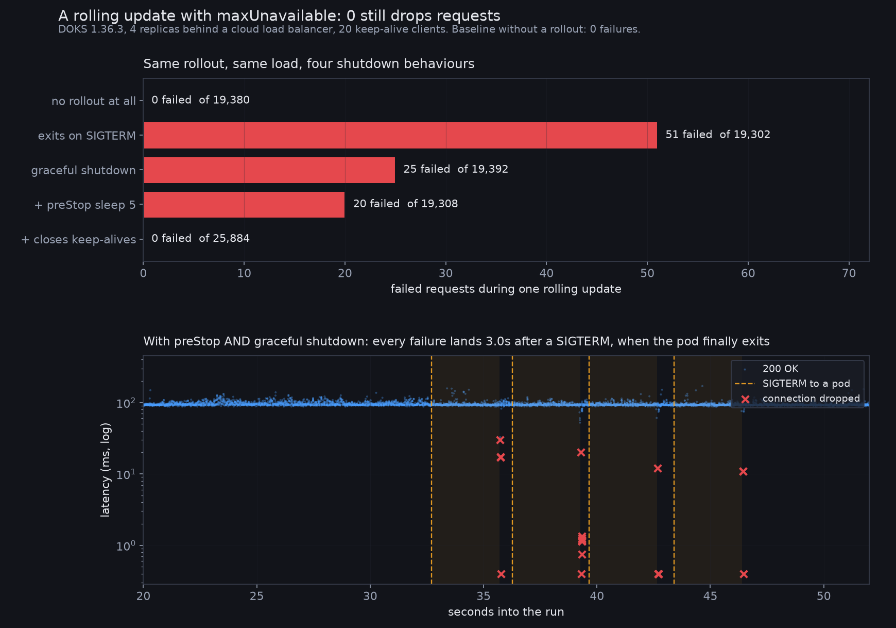

# rolling-update-drops

A Kubernetes rolling update with `maxUnavailable: 0` still drops requests. Adding
graceful shutdown halves it. Adding a `preStop` hook barely helps. Closing your
keep-alive connections while draining is what actually fixes it.

Measured on DOKS 1.36.3, four replicas behind a cloud load balancer, 20 keep-alive
clients at roughly 180 requests per second.



## Numbers

| shutdown behaviour | failures | requests |
|---|---|---|
| no rollout at all (control) | **0** | 19,380 |
| exits immediately on SIGTERM | 51 | 19,302 |
| exits immediately on SIGTERM (repeat) | 35 | 18,966 |
| graceful: stop accepting, exit after 3s | 25 | 19,392 |
| graceful + `preStop: sleep 5` | 20 | 19,308 |
| graceful + `preStop` + closes keep-alives | **0** | 25,884 |
| the same, repeated | **0** | 25,871 |

Every failure is a dropped connection, never a 5xx: `RemoteDisconnected`,
`ConnectionResetError`, `ConnectionRefusedError`.

## Why preStop did not fix it

`preStop` does exactly what it is supposed to. Measuring the gap between a pod
logging `SIGTERM received` and its address leaving the EndpointSlice:

| | median gap |
|---|---|
| no `preStop` | **+0.57s** (endpoint still live after SIGTERM) |
| `preStop: sleep 5` | **-0.06s** (endpoint gone first) |

So the race is real, and `preStop` wins it. The failures that remain are not
caused by the race. With `preStop` in place, **every single failure lands 3.0
seconds after a SIGTERM**, which is exactly when the application process calls
`os._exit`. The load balancer holds established keep-alive connections to that
pod, and exiting severs them.

The fix is to stop the connection pool from containing you:

```python
if draining.is_set():
    self.send_header("Connection", "close")
    self.close_connection = True
```

Then wait long enough for those connections to cycle before exiting, and set
`terminationGracePeriodSeconds` high enough to allow it.

## Reproducing

```bash
doctl kubernetes cluster create droptest --region fra1 \
  --node-pool "name=pool;size=s-2vcpu-2gb;count=2;auto-scale=false" --wait
kubectl create configmap appsrc --from-file=server.py
kubectl apply -f base.yaml
kubectl get svc web -o jsonpath='{.status.loadBalancer.ingress[0].ip}' > lb_ip
./run_variant.sh A_immediate 110 25
```

`SHUTDOWN_MODE` selects the behaviour: `immediate`, `graceful`, or `drain_conns`.

The whole experiment cost about 20 cents of cluster time. **Delete the load
balancer as well as the cluster.** A `type: LoadBalancer` Service provisions a real
one, and it bills whether or not anything is pointing at it.

## Caveats

- One cloud provider's load balancer. The connection-reuse behaviour that causes
  this is not specific to it, but the exact counts will differ.
- The client uses HTTP/1.1 keep-alive, like a real client. A load generator that
  opens a fresh connection per request understates this badly.
- `terminationGracePeriodSeconds` is 30 in variants A to C and 45 in D.

MIT licensed.
