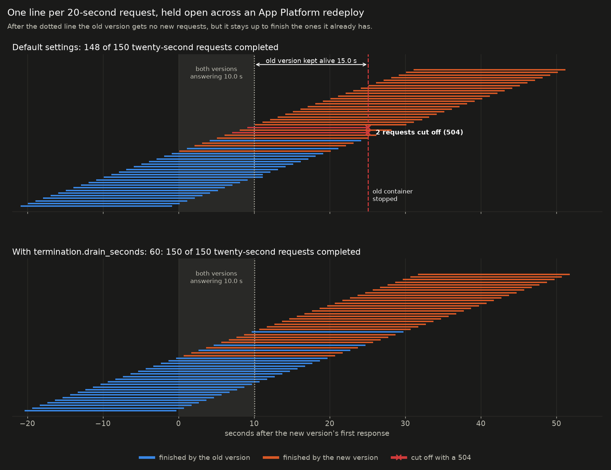
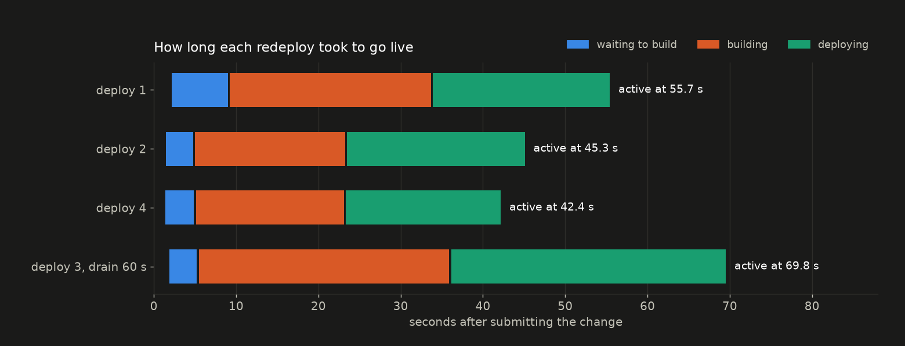

The same `server.py` as the Kubernetes experiment, packaged for DigitalOcean App Platform.
It reports its hostname and a `GEN` environment variable in every response, so a load
generator can see exactly when a redeploy cuts traffic over to the new version.
`SHUTDOWN_MODE` selects the shutdown behaviour, as in the parent directory.

## Results

Four redeploys under load, with the naive version of the app (`SHUTDOWN_MODE=immediate`,
exits the instant it gets SIGTERM), which dropped 51 requests during a rolling update on a
hand-built Kubernetes cluster in the parent experiment.

| | fast requests | failed | 20 s in-flight requests | failed |
|---|---|---|---|---|
| baseline, no deploy | 22,450 | 0 | | |
| deploy 1 | 85,892 | 0 | | |
| deploy 2, default settings | 62,040 | 0 | 150 | 2 (504) |
| deploy 3, `drain_seconds: 60` | 66,981 | 0 | 150 | 0 |
| deploy 4, default settings | 63,101 | 1 (502, 167 s after the deploy) | 150 | 2 (504) |

Both versions answer side by side for 10.0 s. The old version then stops receiving new
requests and is kept alive for **15.0 s** by default, the same in both default runs, before
it is stopped. Requests still running at that point get a 504. `termination.drain_seconds`
extends that window; with 60 s, every in-flight request finished.

Reproduce: `doctl apps create --spec spec.yaml`, write the URL to `app_url` and the ID to
`app_id`, then `./run_deploy.sh <label> <new-gen> immediate 300`. Changing only an env var
reuses the previous build; use `doctl apps create-deployment <id> --force-rebuild` to pick
up new commits from a plain git source.
